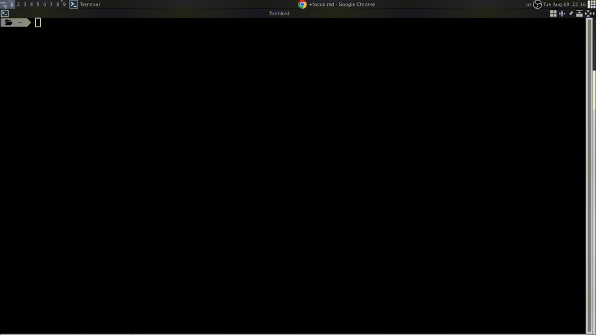
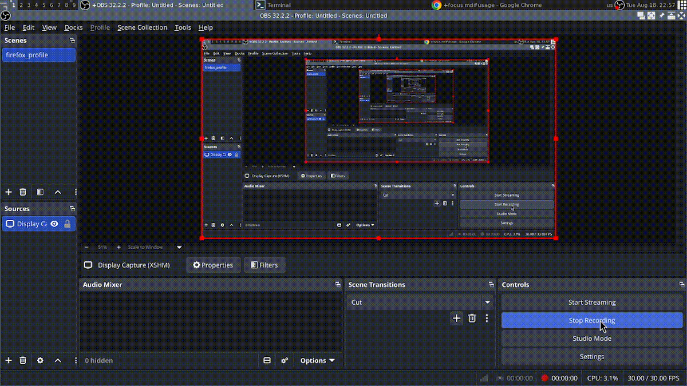

# Focus

Automated script to quickly launch distraction-free focus music from SongSara.

## Preview



## Overview

Finding and playing background focus music can disrupt your workflow. **Focus** is a lightweight automation script designed to eliminate manual steps and open curated instrumental focus music directly from [SongSara](https://songsara.net).

It automates browser launching using an isolated Firefox profile, ensuring no VPN/Proxy conflicts with Iranian local services.

## Prerequisites

- **Firefox**

### Why a dedicated profile?

SongSara is an Iranian service and requires direct connection without a VPN/Proxy. To keep your main browsing session and network routing separate, this script relies on a dedicated Firefox profile.

## Setup

1. Open the Firefox Profile Manager:

   ```bash
   firefox -P
   ```

2. Create a new profile named exactly **`Music`** _(case-sensitive)_.

   

3. Start Firefox with the `Music` profile and log in to your **SongSara** account.
4. Close the browser.

## How It Works

1. Launches Firefox using the dedicated **`Music`** profile.
2. Navigates directly to the SongSara _Focus / Instrumental_ playlist.
3. Keeps your credentials and direct-connection setup preserved across runs.
