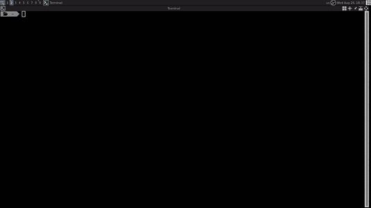

# Lab User Guide

`lab` is an interactive terminal-based environment manager for creating, opening, and deleting Git worktree-based Labs.

---

# Preview



## What it does

`lab` gives you a fast `fzf` dashboard for managing isolated development environments inside a Git repository.

You can:

- create a new Lab from the current repository
- reopen an existing Lab
- inspect worktree status
- delete a Lab when no longer needed

---

## Requirements

- `git`
- `fzf`
- Bash-compatible shell
- A Git repository as the starting point

---

## Installation

Make sure the `lab` script is available in your `PATH`:

```bash
export PATH="$HOME/.dotfiles/scripts:$PATH"
```

```

```

Then make it executable:

```bash
chmod +x ~/.dotfiles/scripts/lab
chmod +x ~/.dotfiles/scripts/lab-preview
```

---

## Basic Usage

Run:

```bash
lab
```

This opens the dashboard in the current Git repository.

---

## Dashboard Behavior

The dashboard works in a search-or-create style:

- type a new Lab name and press `Enter` to create one
- select an existing Lab and press `Enter` to open it
- press `Ctrl-D` on a selected Lab to delete it

---

## Key Bindings

| Key              | Action                                                     |
| :--------------- | :--------------------------------------------------------- |
| `Enter`          | Open selected Lab or create a new one from the typed query |
| `Ctrl-D`         | Delete selected Lab                                        |
| `Esc` / `Ctrl-C` | Exit dashboard                                             |

---

## Lab Lifecycle

1. Start from a Git repository
2. Run `lab`
3. Select or create a Lab
4. Work inside the isolated shell
5. Exit back to the dashboard
6. Delete the Lab when done

---

## Safety Notes

Deleting a Lab removes its associated worktree and metadata.
Only delete Labs you no longer need.

Nested Labs are blocked to prevent accidental recursion or environment corruption.

---

## Status Indicators

The dashboard shows symbols that help identify Lab state:

- `●` dirty worktree
- `!` missing or broken worktree
- clean entries for healthy Labs

---

## Troubleshooting

If the dashboard does not open correctly:

- ensure `fzf` is installed
- ensure you are inside a Git repository
- run with debug mode if needed:
  ```bash
  LAB_DEBUG=1 lab
  ```

---

## See Also

- [Lab Architecture](https://github.com/sync-config/dotfiles-docs/blob/main/scripts/lab/architecture.md)
