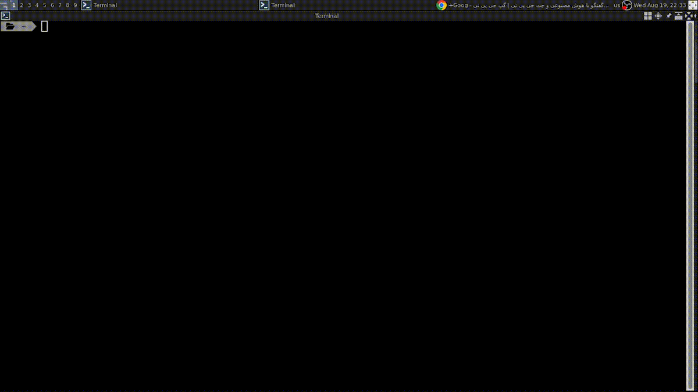

# Tmux Project Manager



A lightweight terminal utility for managing project-based `tmux` sessions with an interactive [`fzf`](https://github.com/junegunn/fzf) interface.

The script allows you to:

- Search through existing `tmux` sessions
- Attach to a session from outside `tmux`
- Switch to another session from inside `tmux`
- Create a new project directory and `tmux` session when no matching session exists
- Delete a selected `tmux` session directly from the `fzf` interface

---

## Features

- Interactive project/session search using `fzf`
- Automatic detection of the current `tmux` context
- Automatic `attach` or `switch-client`
- Automatic creation of project directories
- Automatic creation of new `tmux` sessions
- Session preview inside `fzf`
- Deletion of sessions with `Ctrl+D`
- Current session hidden from the session list

---

## Requirements

The following tools must be installed and available in your `PATH`.

### tmux

The script uses `tmux` to create, switch, attach to, and delete terminal sessions.

- [tmux documentation](https://github.com/tmux/tmux)

### fzf

The script uses `fzf` to provide an interactive fuzzy-search interface.

- [fzf repository](https://github.com/junegunn/fzf)

### Installation

#### Arch Linux

```bash
sudo pacman -S tmux fzf
```

#### Debian/Ubuntu

```bash
sudo apt install tmux fzf
```

---

## Usage

Run the project manager command:

```bash
tmux-project-manager
```

Depending on how the script is installed, you may also run it directly:

```bash
./tmux-project-manager
```

After running the command, an interactive `fzf` window will open with the available `tmux` sessions.

---

## How It Works

### 1. Search for a session

When the script starts, it displays the available `tmux` sessions in an interactive `fzf` interface.

Type part of a session name to filter the list:

```text
Project> dot
```

Then select the desired session and press `Enter`.

### 2. Switch to a session from inside tmux

If the command is executed from inside a `tmux` session, the script uses:

```bash
tmux switch-client -t <session-name>
```

This switches the current client to the selected session.

### 3. Attach to a session from outside tmux

If the command is executed from a normal terminal, outside of `tmux`, the script uses:

```bash
tmux attach-session -t <session-name>
```

This attaches the terminal to the selected session.

### 4. Create a new project and session

If the entered project name does not match an existing `tmux` session, the script:

1. Creates a new project directory
2. Creates a new `tmux` session with the same name
3. Starts the session in the new project directory

For example, if you enter:

```text
my-new-project
```

The script creates:

```text
<projects-directory>/my-new-project
```

and a `tmux` session named:

```text
my-new-project
```

The exact project directory is determined by the script configuration.

---

## Keybindings

| Key      | Action                                               |
| -------- | ---------------------------------------------------- |
| `Enter`  | Attach to or switch to the selected session          |
| `Ctrl+D` | Delete the selected `tmux` session                   |
| `Esc`    | Exit without selecting a session                     |
| Typing   | Filter existing sessions or enter a new project name |

> Be careful when using `Ctrl+D`. Deleting a `tmux` session terminates all running processes and panes inside that session.

---

## Session Preview

The `fzf` preview displays information about the selected session, such as:

- Session name
- Current working directory
- Available windows
- Recent output from the active pane

This allows you to inspect a session before switching to or attaching to it.

---

## Example Workflow

Assume the following sessions exist:

```text
dotfiles
airpart
knowledge-base
```

You run:

```bash
tmux-project-manager
```

Then:

1. Type `dot`
2. Select `dotfiles`
3. Press `Enter`

The script will:

- Switch to `dotfiles` if you are already inside `tmux`
- Attach to `dotfiles` if you are outside `tmux`

To create a new project:

1. Run the command
2. Type a new name, for example `new-project`
3. Press `Enter`

The script will create the project directory and its corresponding `tmux` session automatically.

---

## Project and Session Naming

Project directories and `tmux` sessions use the same name.

For example:

| Project       | Directory                          | tmux session  |
| ------------- | ---------------------------------- | ------------- |
| `dotfiles`    | `<projects-directory>/dotfiles`    | `dotfiles`    |
| `airpart`     | `<projects-directory>/airpart`     | `airpart`     |
| `new-project` | `<projects-directory>/new-project` | `new-project` |

Using the same name for both makes projects and sessions easier to find and manage.

---

## Troubleshooting

### Check installed dependencies

```bash
tmux -V
fzf --version
```

### List existing sessions

```bash
tmux list-sessions
```

### Check whether a session exists

```bash
tmux has-session -t <session-name>
```

### Check the current tmux session

```bash
tmux display-message -p '#S'
```

### Make the script executable

```bash
chmod +x ./tmux-project-manager
```

### Run the script with Bash

```bash
bash ./tmux-project-manager
```

---

## Safety Notes

- Deleting a session with `Ctrl+D` permanently terminates that `tmux` session.
- All processes running inside the deleted session may also be terminated.
- The current session is excluded from the list to prevent accidentally deleting the session currently in use.
- Avoid using spaces or special characters in project/session names unless they are explicitly supported by the script.

---
